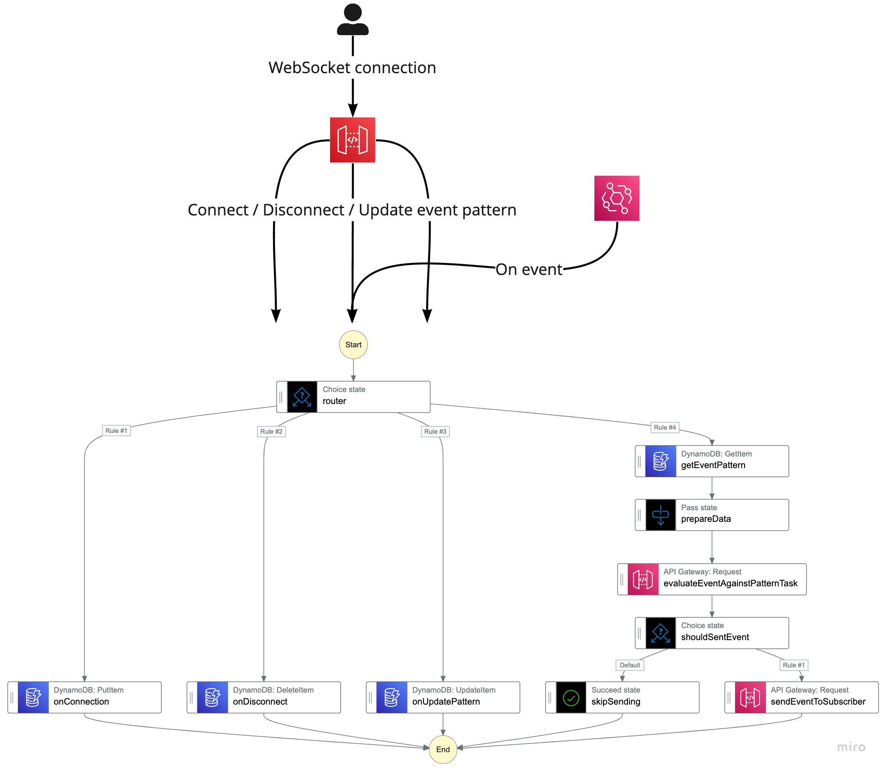

# Lambda-less AWS API Gateway WebSockets

Inspired by [this construct](https://github.com/boyney123/cdk-eventbridge-socket), I've decided to replicate it but put my little twist on the architecture - make it Lambda-less.

Why? Mainly for learning purposes. I've only consumed the _WebSockets_ part of the AWS API Gateway via Lambdas so far.

## Architecture

Here is a birds-eye view of the architecture that this repo deploys.



## Deployment

This repo uses _AWS CDK_ as the IaC tool. To deploy the infrastructure:

1. Ensure that you have your AWS credentials set-up.
2. Run `npm run bootstrap` if your environment is not _bootstrapped_ by _AWS CDK_ yet.
3. Run `npm run deploy`.

## Usage

1. Copy the `webSocketAPIurl` from the deployment outputs.
2. Connect to the `webSocketAPIurl`. There are many tools available to you to do that. One might use [`websocat`](https://github.com/vi/websocat) or [`Postman`](https://learning.postman.com/docs/sending-requests/supported-api-frameworks/websocket/)
3. Specify the pattern you want to filter the _EventBridge_ events on. This is done by sending a message with a `pattern` property.
   The `pattern` property corresponds to the (_EventBridge event pattern_)[https://docs.aws.amazon.com/eventbridge/latest/userguide/eb-event-patterns.html]

   Here is an example of a _catch-all_ event pattern.

```json
{ "action": "pattern", "pattern": { "version": ["0"] } }
```

4. Whenever an event is pushed to the _EventBridge_ bus created by this construct the event payload will be matched against the _pattern_ specified in the previous step. If the payload matches the _pattern_, the event payload will be sent to your _WebSocket_ connection.

## Learnings

- The CFN will not show you that APIGW Integration drifted as this resource is not "drift-enabled"

- If you are not sure how the resource is structured and you are not able to export it (like in the case of APIGW v2 where the API definition cannot be exported), look into network tab. You will most likely find useful resource information there.

- Similarly to how the _APIGW Mock Integration_ works, first you have to allow for parameters within the _route_ resource,
  then you can specify the mapping within the _integration_ resource.

- It seems like some _integration request data mapping expressions_ are not working? At least I could not get them to work.
  According to [this documentation page](https://docs.aws.amazon.com/apigateway/latest/developerguide/websocket-api-data-mapping.html) I should be able to use all of the mapping expressions.

  - Only the `request.querystring` and the `request.header` were working.
  - The attached example, while helpful, does not show all possible cases.
  - The `RequestParameters` parameter in CFN seems to confirm that only `querystring`, `path` and `header` are allowed.

- For the WebSockets + _non-proxy_ integration, we cannot pass the `StateMachineArn` and the `Input` parameters just like we would in the case of
  a PROXY integration.

- I was able to make the `$connect` route work by **specifying the `integration`, `integrationResponse` and the `routeResponse`**.
  **Keep in mind that the `integrationResponse` will not show in the AWS console**.

- The `templateSelectionExpression` is an expression that will dictate which of the `requestTemplate` is picked upon a request / response.
  The `\\$default` is a _catch-all_ and will evaluate to a `requestTemplate` with a key of `$default`.
  This whole mechanism is very similar to creating a _MOCK_ type integration via APIGW. It allows you to create responses based on the integration response.

- There is **no easy way to configure _access logs_ / _execution logs_ for the APIGW v2**. You have to drill into L1 resources and monkey-patch properties.

- Remember about the **_State Machine_ type**. I just wasted about 5 hours of trying various configuration only to notice that I've tried using the
  `StartSyncExecution` API call on state machine that is of type _STANDARD_.

- Sadly we cannot invoke given service endpoint directly using _Step Functions_.
  We can invoke the APIGW via the endpoint but the endpoint is validated. You cannot cheat the system :C

  As alternative, you can create an APIGW endpoint that invokes the service you are interested directly.
  While not really cost efficient, it should get the job done.

- How do you debug routes and responses?

  - If you are integrating with other AWS service, you might want to get response from the service API. With a static response template this is impossible to do.
  - **To forward the response from the service API, specify the `integrationResponseKey` as `$default` but DO NOT specify the response template**.

- When using **_direct service integrations_** be **mindful of headers that the service call expects**.
  Sometimes you have to specify the `X-Amz-Target`, sometimes it's the path that dictates the routing.
